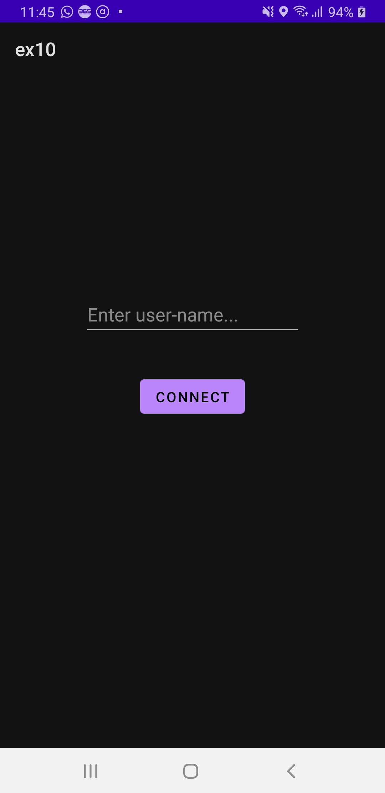

# Remote-Server-Communication-Android

## Theoretical Questions:
(a) Save token localy: pro- Quick access to the token on each launch of the app
                       con- Less secure, the token is not changing and therefore can be monitored and intercepted more easily
(b) Re-request token on each app-launch: pro- More secure, the token is much harder to retrieve by unwanted third parties
                                         con- Less efficient, a server request is performed on each app launch in order to retrive a new token.

I pledge the highest level of ethical principles in support of academic excellence. I ensure that all of my work reflects my own abilities and not those of someone else.

